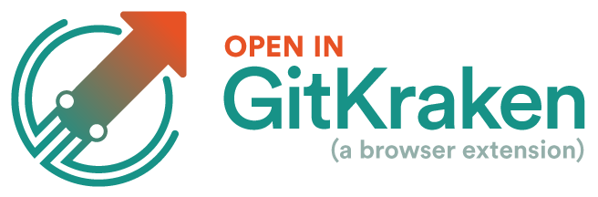
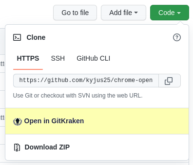

<!-- ALL-CONTRIBUTORS-BADGE:START - Do not remove or modify this section -->

<!-- ALL-CONTRIBUTORS-BADGE:END -->

<h1>Open in GitKraken 🐙+🦑=⚡️</h1>

⚡ Navigate to or clone repositories in a jiffy using GitKraken's [deep link API](https://help.gitkraken.com/gitkraken-client/linking)

<h3>Table of Contents</h3>

- [Browser support 🤝](#browser-support-)
- [Installation 🏁](#installation-)
- [Usage 🦑](#usage-)
- [Contributors ✨](#contributors-)

---

## Browser support 🤝

 |  |  |  | 
:-: | :-: | :-: | :-: | :-: |
✅ | ✅ | ✅ | ❌ | ❌ |

>**Chrome**, **Brave**, and **Edge** all support the Chrome extension but as it is still in alpha and not in the Chrome Web Store, manual installation will be required.
>
>Support for **Firefox** and **Safari** coming soon.

## Installation 🏁

The extension is not currently in the Chrome Web Store as it is still in alpha. To install it manually, open your chrome extensions tab at `chrome://extensions/` and enable developer mode.

Then, download and extract this project to a folder on your computer, and import the folder with the "Load Unpacked" button in the extensions page.

## Usage 🦑

Install the extension and open GitHub to a **public** repository (private repos are not currently supported, see [issue](https://github.com/kyjus25/chrome-open-in-gk/issues/3)). The extension will generate a GitKraken deep link for the repository and inject a button in the "clone" dropdown to open or clone the repository directly with GitKraken!

## Contributors ✨

Thanks goes to these wonderful people ([emoji key](https://allcontributors.org/docs/en/emoji-key)):

<!-- ALL-CONTRIBUTORS-LIST:START - Do not remove or modify this section -->
<!-- prettier-ignore-start -->
<!-- markdownlint-disable -->
<table>
  <tr>
    <td align="center"><a href="http://justinwhite.info"> <b>Justin White</b></a> <a href="https://github.com/kyjus25/chrome-open-in-gk/commits?author=kyjus25" title="Code">💻</a></td>
    <td align="center"><a href="https://codepen.io/brandonmcconnell"> <b>Brandon McConnell</b></a> <a href="https://github.com/kyjus25/chrome-open-in-gk/commits?author=brandonmcconnell" title="Code">💻</a></td>
  </tr>
</table>

<!-- markdownlint-restore -->
<!-- prettier-ignore-end -->

<!-- ALL-CONTRIBUTORS-LIST:END -->

This project follows the [all-contributors](https://github.com/all-contributors/all-contributors) specification. Contributions of any kind welcome!
